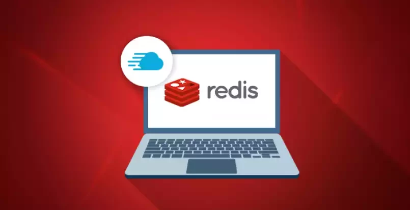
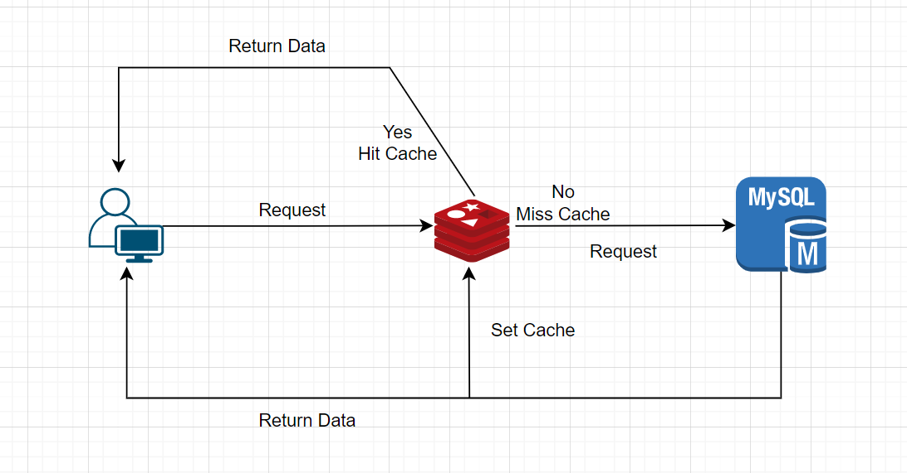
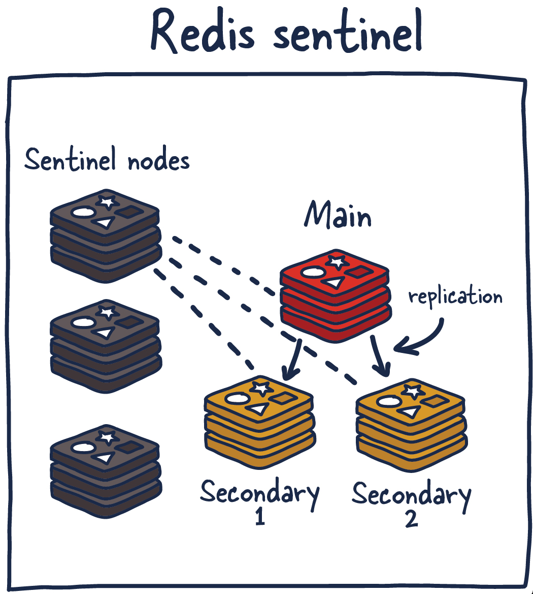

# **Bạn và Tôi hiểu gì về Redis?**  

  

## **Mục lục**  

- [✔️] > [Redis là gì?](#)  
- [✔️] > [Redis làm được những gì?](#)  
- [✔️] > [Redis hoạt động như thế nào? ](#)  
- [✔️] > [Redis Persistence là gì?](#)  
- [✔️] > [Redis Replication là gì?](#)  
- [✔️] > [Redis Sentinel là gì?](#)  
- [✔️] > [Redis Cluster là gì?](#)  
- [✔️] > [Cách cài đặt và cấu hình một Redis server trên Server Linux.](#)  
- [✔️] > [Cấu hình Redis nâng cao.](#)  

## **1. Redis là gì?**

Redis (Remote Dictionary Server) là một hệ thống cơ sở dữ liệu NoSQL, hay nói cách khác là một In-memory database hoạt động với phương thức key-value và được lưu trong bộ nhớ Ram thay vì lưu dữ liệu trong Disk. Thường được sử dụng rộng rãi trong các ứng dụng web và các hệ thống phân tán.  
  
Tận dụng tốc độ xử lý cao của Ram, Redis cung cấp thời gian phản hồi trong vòng 10^3^s giây, cho phép hàng triệu yêu cầu mỗi giây bởi các ứng dụng yêu cầu thời gian thực như trò chơi, tài chính, y tế ,IoT ...  

Hiện nay, Redis là một trong những công cụ mã nguồn mở phổ biến nhất. Nhờ hiệu suất mạnh mẽ và thời gian phản hồi nhanh chóng, Redis là sự lựa chọn phổ biến cho các lập trình viên trong việc caching, quản lý session, gaming, bảng xếp hạng, số liệu thống kê, phân tích thời gian thực, chat/messaging, media streaming, và các ứng dụng pub/sub ....  

## **2. Redis làm được những gì?**  

Nhắc đến Redis sẽ không ít người hiểu nhầm rằng Redis chỉ dùng để lưu cache. Tuy nhiên Redis có thể làm được nhiều hơn thế. Chúng ta hãy cùng xem đó là gì nhé!

### **2.1. Caching**

Đặc điểm của Redis là dữ liệu được lưu trong Ram, do đó dữ liệu sẽ bị mất nếu service Redis bị lỗi, hay khi server bị restart. Nên có nhiều lập trình viên sử dụng Redis như bột bộ nhớ Cache, nhằm giảm độ trễ truy cập/xử lý dữ liệu, giảm tải cho server/service không phải xử lý đi xử lý lại các yêu cầu mất khá nhiều thời gian để tính toán.  

Cũng có thể nói đây là tính năng phổ biến và chuộng nhiều người dùng nhất hiện nay.  

### **2.2. Chat, messaging và queue**  

Hỗ trợ các ứng dụng có tính năng Pub/Sub (Publish/Subscribe), các ứng dụng chatbot, trò chuyện trực tiếp, real-time comment streaming. Giúp làm giảm độ trễ tương tác giữa các người dùng.  

Tạo hàng đợi để xử lý lần lượt các request. Redis cho phép lưu trữ theo list và cung cấp rất nhiều thao tác với các phần tử trong list, vì vậy nó còn được sử dụng như một message queue.  

### **2.3. Session**  

Giúp xử lý và lưu trữ hàng nghìn, hạng triệu Session của người dùng chẳng hạn như hồ sơ người dùng, thông tin xác thực đăng nhập, trạng thái phiên...  

### **2.4. Counter** 

Sử dụng làm bộ đếm. Với thuộc tính tăng giảm thông số rất nhanh trong khi dữ liệu được lưu trên RAM, sets và sorted sets được sử dụng thực hiện đếm lượt view của một website, các bảng xếp hạng trong game.

### **2.5. Real-time analytics** 

Redis là lựa chọn lý tưởng cho các trường hợp sử dụng phân tích thời gian thực như phân tích phương tiện truyền thông xã hội, mục tiêu quảng cáo, cá nhân hóa và IoT.  

## **3. Redis hoạt động như thế nào?**  
Ở đây mình sẽ nói về cách hoạt động của Redis cache để mọi người có thể dễ dàng hình dung.  

Trường hợp Redis đã lưu dữ liệu ( Hit Cache): **Người dùng gửi yêu cầu > Redis kiểm tra yêu cầu > Yes > trả dữ liệu cho người dùng**. 

Trường hợp Redis chưa lưu dữ liệu ( Miss Cache): **Người dùng gửi yêu cầu > Redis kiểm tra yêu cầu > No > Request đến Database Mysql > Trả dữ liệu cho người dùng > Set Cache vào Redis**.  

## **4. Redis Persistence là gì?**  

Bạn hãy thử tượng tượng điều gì xảy ra nếu toàn bộ dữ liệu quan trọng (mất nhiều thời gian compute mới có được) bị mất sạch sau 1 lần gặp sự cố mà không thể khôi phục được. Với Redis thì điều này đã được lường trước, và **Redis Persistence** chính là phương pháp giúp chúng ta khắc phục vấn đề này.  

Redis Persistence là khả năng lưu trữ dữ liệu trên Disk để đảm bảo tính bền vững (durability) của Redis. Redis cung cấp hai cơ chế Persistence: **RDB (Redis Database)** và **AOF (Append-Only File)**.  
 
   - **RDB** là quá trình tạo ra một bản sao của dữ liệu Redis (**snapshot**) trong một thời điểm cụ thể được cấu hình và sẽ lưu data vào Disk. 
 
   - **AOF** lưu lại tất cả các hoạt động Write vào Redis, tạo ra một file dạng log để phục hồi dữ liệu sau khi khởi động lại hệ thống. 

   - **RDB + AOF**: Kết hợp cả 2 options trên. Nhưng khi Redis restart thì AOF sẽ được ưu tiên sử dụng để init data. 
 
 Bằng cách sử dụng Redis Persistence, bạn có thể khôi phục dữ liệu sau một sự cố và đảm bảo rằng dữ liệu không bị mất.

 ## **4. Redis Replication là gì?**  

 Redis Replication là quá trình sao chép dữ liệu từ một Redis master (chủ) sang nhiều Redis slave (phụ). Khi có sự thay đổi dữ liệu trên Redis master, nó sẽ được chuyển tiếp đến tất cả các Redis slave để đảm bảo dữ liệu được đồng bộ trên toàn bộ hệ thống. Redis Replication cung cấp khả năng chịu lỗi (fault-tolerance) và tăng cường hiệu suất bằng việc cho phép đọc dữ liệu từ các Redis slave.  

 ## **4. Redis Sentinel là gì?**  

 Redis Sentinel là một công cụ giám sát và quản lý hệ thống Redis. Nó giúp theo dõi sự hoạt động của các Redis master và slave, và tự động thực hiện quá trình failover (chuyển giao) khi một Redis master không hoạt động. Redis Sentinel giúp đảm bảo tính sẵn sàng và ổn định của hệ thống Redis bằng cách tự động chọn một Redis slave mới để thay thế Redis master gốc.

 ## **4. Redis Cluster là gì?**  

 Redis Cluster là một cách để chia nhỏ dữ liệu và phân chia nó trên nhiều nút Redis để tạo thành một cụm (cluster). Cụm Redis Cluster được xây dựng để cung cấp khả năng mở rộng ngang (horizontal scalability) và tính sẵn sàng cao. Dữ liệu được phân phối trên các nút của cụm Redis Cluster và các nút này hoạt động độc lập nhưng vẫn hợp tác để đảm bảo tính nhất quán và hiệu suất cao. Redis Cluster cung cấp khả năng chịu lỗi và mở rộng tự động khi thêm hoặc xóa các nút trong cụm.